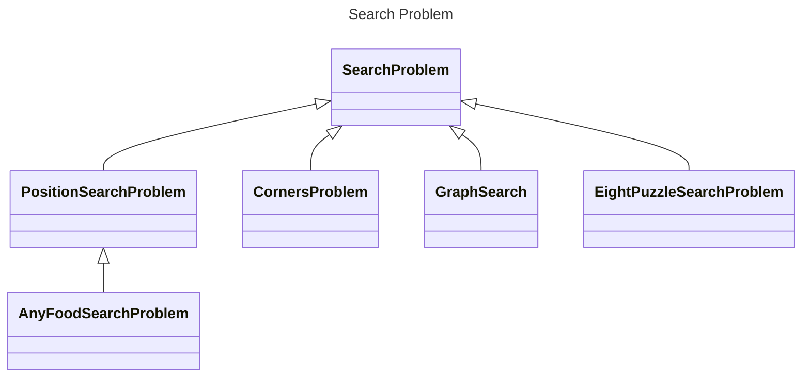
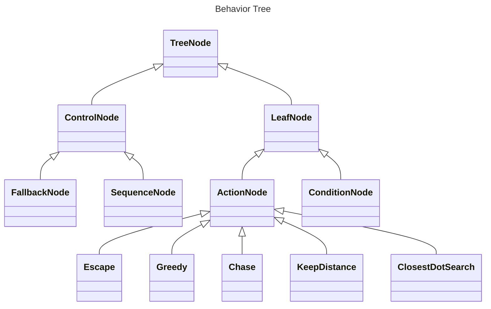
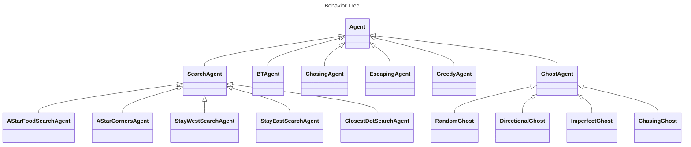

```mermaid
---
title: Search Problem
---
classDiagram
    SearchProblem <|-- PositionSearchProblem
    SearchProblem <|-- CornersProblem
    SearchProblem <|-- GraphSearch
    SearchProblem <|-- EightPuzzleSearchProblem
    PositionSearchProblem <|-- AnyFoodSearchProblem

    class PositionSearchProblem 
    class CornersProblem
    class GraphSearch
    class EightPuzzleSearchProblem
    class AnyFoodSearchProblem
```

```mermaid
---
title: Behavior Tree
---
classDiagram

  class TreeNode
  
  class LeafNode
  
  class ConditionNode
  
  class ControlNode
  
  class FallbackNode
  
  class SequenceNode
  
  class ActionNode
  
  class Escape
  
  class Greedy
  
  class Chase
  
  class KeepDistance
  
  class ClosestDotSearch
  
  TreeNode <|-- ControlNode
  TreeNode <|-- LeafNode
  
   LeafNode <|-- ActionNode
   LeafNode <|-- ConditionNode
  
   ControlNode <|-- FallbackNode
   ControlNode <|-- SequenceNode
  
   ActionNode <|-- Escape
   ActionNode <|-- Greedy
   ActionNode <|-- Chase
   ActionNode <|-- KeepDistance
   ActionNode <|-- ClosestDotSearch
  

```

```mermaid
---
title: Behavior Tree
---
classDiagram
  class Agent
  
  class SearchAgent
  
  class AStarFoodSearchAgent
  
  class AStarCornersAgent
  
  class StayWestSearchAgent
  
  class StayEastSearchAgent
  
  class ClosestDotSearchAgent

  class BTAgent {
    
  }
  
  class ChasingAgent {
    
  }
  
  class EscapingAgent {
    
  }
  
  class GreedyAgent {
    
  }
  
  class GhostAgent {
    
  }  

  class ImperfectGhost {
    
  }  

  class RandomGhost {
    
  }  

  class DirectionalGhost {
    
  }  
      
  class ChasingGhost {
 
  }

   Agent <|-- BTAgent
   Agent <|-- SearchAgent
   Agent <|-- ChasingAgent
   Agent <|-- EscapingAgent
   Agent <|-- GreedyAgent
   Agent <|-- GhostAgent

   SearchAgent <|-- AStarFoodSearchAgent
   SearchAgent <|-- AStarCornersAgent
   SearchAgent <|-- StayWestSearchAgent
   SearchAgent <|-- StayEastSearchAgent
   SearchAgent <|-- ClosestDotSearchAgent
  
   GhostAgent <|-- RandomGhost
   GhostAgent <|-- DirectionalGhost
   GhostAgent <|-- ImperfectGhost
   GhostAgent <|-- ChasingGhost
```
